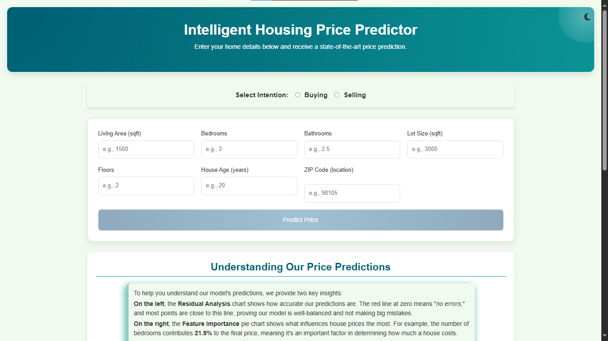
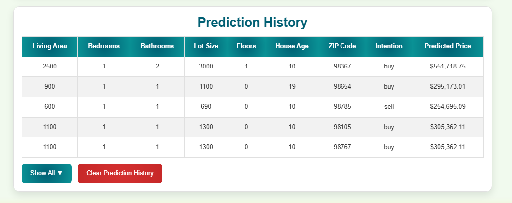
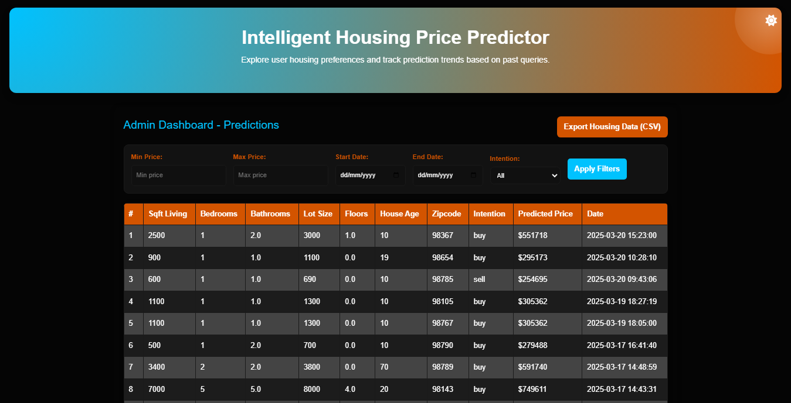
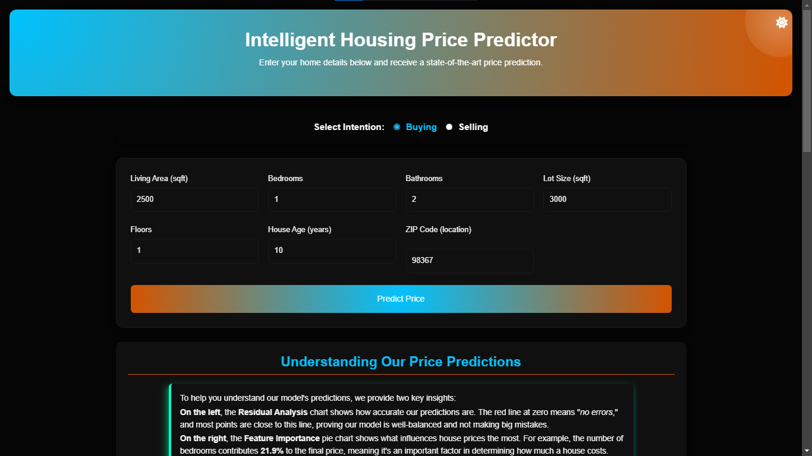

# Intelligent Housing Forecasting Model Using Machine Learning  

## Description  

The **Intelligent Housing Forecasting Model** is a machine learning-powered web application that predicts house prices based on user-input features. It utilizes **LightGBM**, a high-performance gradient boosting algorithm, to provide accurate price estimations with an **80% R² score**.  

Designed for both buyers and sellers, the system not only predicts home values but also offers **real-time market insights, tailored recommendations, and ZIP-code-based trends**, making it a valuable tool for real estate decisions.

## Features

- **Accurate Housing Price Prediction** – Predicts house prices using a trained LightGBM model.  
- **Confidence Interval Display** – Provides a price range to indicate prediction uncertainty.  
- **Realtor.com Integration** – Generates a dynamic link to Realtor.com based on user-entered features.  
- **AI-Powered Chatbot** – Offers tailored insights and recommendations for buyers and sellers.  
- **Admin Dashboard** – Displays user input trends, filtering options (date, price, intent), and CSV data export.  
- **User History Tracking** – Stores user inputs locally, persisting across sessions unless manually cleared.  
- **Market Trends by ZIP Code** – Provides ZIP-specific insights, including price trends, competition, and location type.  
- **Light/Dark Mode Toggle** – Allows users to switch between light and dark themes.  

## Installation  

Follow these steps to set up and run the project locally:  

### Prerequisites  

Ensure you have the following installed:  
-**Python 3.8+**  
-**pip (Python package manager)**  
-**Git** (optional, for cloning the repository)  

### 1. Clone the Repository  

```sh
git clone https://github.com/Kennedy178/predict_project.git
cd predict_project
```

### 2. Install Dependencies

```sh
pip install -r requirements.txt
```

### 3. Run the Application

```sh
python run.py
# The app will be accessible at: http://127.0.0.1:5000/
```

## Usage: How to Use the Project

Follow these steps to interact with the **Intelligent Housing Forecasting Model Using Machine Learning**:

### Accessing the System

1. **Open the Web App**  
   - Run the Flask server and open `http://127.0.0.1:5000/` in your browser.  
   - You will see the homepage with input fields for housing details.  
   - 

2. **Enter Property Details**
   - Select your intention: Are you looking to get a price estimate for a house you intend to buy or sell?
   - Fill in details such as ZIP code, house size, number of rooms, and purpose (buy/sell).

3. **Submit & Get Predictions**  
   - Click "Predict Price" to see the estimated house price.  
   - The system will display:
     - **Predicted Price**
     - **Confidence Interval (Price Range)**
     - **A dynamic link to Realtor.com** (to explore houses based on input)
     - **AI Chatbot for Insights & Recommendations**  
   -   

4. **User History Tracking**  
   - Your past inputs are stored in **Local Storage** and persist even after refreshing.  
   - Click "Clear History" if you want to reset.  
   -   

5. **Admin Dashboard (For Market Trends)**  
   - Open `http://127.0.0.1:5000/admin` or simply (Admin dashboard) link to view user preferences and housing trends.
   - This table fetches the stored user inputs and predictions from the database.  
   - Filter data based on **date, price range, and buy/sell intention**.  
   - Option to **download CSV reports** (filtered or full dataset).  
   -   

6. **Dark Mode Toggle**  
   - Click the 🌙/☀️ icon at the top-right corner to switch between dark and light mode.  
   - 

## Technologies Used

This project is built using the following technologies:

- **Programming Language:** Python  
- **Framework:** Flask (for the web application)  
- **Machine Learning Algorithm:** LightGBM (trained with an 80% R² score)  
- **Database:** SQLite (stores user inputs, predictions, and trends)  
- **Front-end:** HTML, CSS, JavaScript (for the user interface)

## Contributing

Contributions are welcome! If you'd like to improve this project, follow these steps:

1. Fork the repository  
2. Clone your fork  
3. Create a new branch  
4. Make your changes  
5. Commit your changes  
6. Push to GitHub  
7. Submit a pull request  

   - Open a pull request on GitHub, and your changes will be reviewed.  
   - Please follow best coding practices and ensure your changes do not break existing functionality.  
   - If you are fixing an issue, reference the issue number in your commit message.  
   - All contributions must comply with the [MIT License](LICENSE).

## License

This project is open-source under the [MIT License](LICENSE).  
You are free to use, modify, and distribute it with proper attribution to the original authors.

## Limitations & Future Enhancements

- **ZIP Code Support:**  

 > **Note:** _Currently, the system supports ZIP codes **98001–99001 (Washington state)** as a **proof-of-concept**. Future updates will expand coverage to include more locations._
